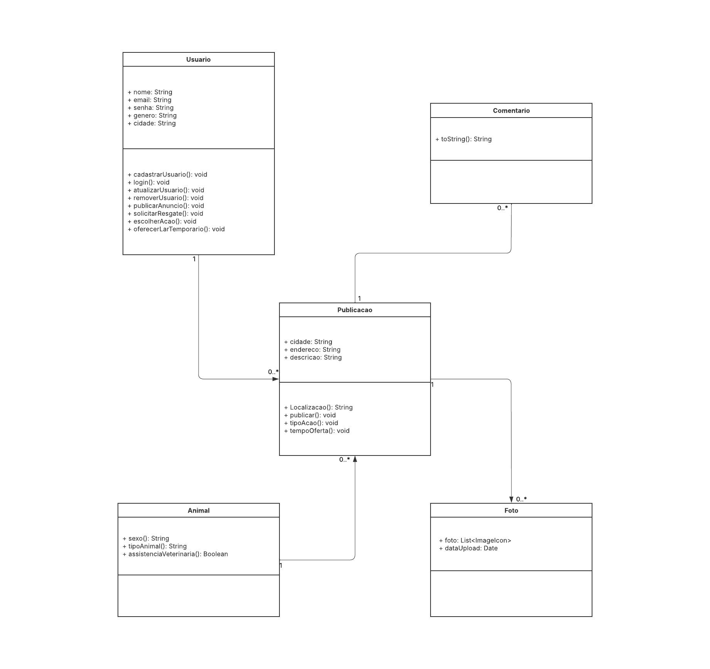
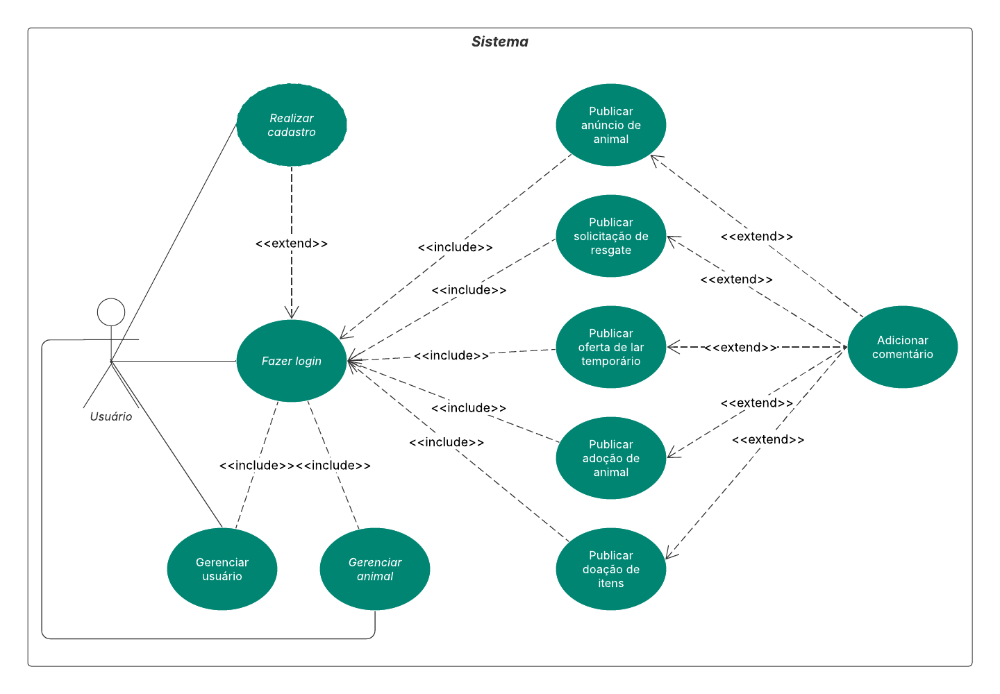

# Sistema de Gerenciamento da Causa Animal

Este sistema está começando a ser desenvolvido com o objetivo de funcionar como uma *rede social voltada para a causa animal*. O sistema permitirá anunciar pets perdidos, informar sobre animais abandonados, divulgar ações de adoção, além de oferecer ou solicitar ajuda, como doações de ração ou lares temporários.

## Objetivo do Projeto

Criar um sistema que auxilie a:

- Encontrar animais perdidos  
- Encaminhar pets para adoção responsável  
- Reduzir o número de animais abandonados nas ruas  
- Conectar pessoas dispostas a ajudar a quem precisa de apoio

## Problema a Ser Resolvido

Muitos animais são abandonados todos os dias, e quem quer ajudar, como voluntários, ONGs e cidadãos comuns, muitas vezes não consegue se comunicar de forma rápida e organizada. Sem um lugar central para divulgar essas informações, fica difícil unir forças e fazer com que as ações realmente tenham impacto. E através da criação de um sistema unificado e acessível, será possível promover a *empatia, o **voluntariado* e a *adoção consciente*, além de facilitar o compartilhamento de informações importantes e o apoio dentro da comunidade.

## Público-Alvo

- Protetores independentes  
- ONGs de proteção animal  
- Cuidadores temporários  
- Pessoas interessadas em adotar ou ajudar animais

## Sobre o projeto

Este projeto está sendo desenvolvido como parte da disciplina de Teste de Software, com o objetivo de aplicar na prática os conhecimentos adquiridos.

## Funcionalidades

- Cadastro de usuário
- Login
- Atualizar dados pessoais
- Remover conta
- Publicação de animais perdidos
- Publicação de solicitação de resgate
- Publicação de oferta de lar temporário
- Ações de adoção de animais
- Ações de doação de itens
- Comentários nas publicações

## Requisitos

### Link: https://docs.google.com/document/d/1MGLWibnqlCr8ohy6zmXXbSQ3mpZLP1MkVvk7VH6y0WI/edit?usp=sharing

## Diagrama de classe e caso de uso

### Diagrama de Classe

### Diagrama de Casos de Uso

## Plano de teste

### Link: https://docs.google.com/document/d/1eoneNlYJbcNb8QwIK3_SNCSZzrJPcfX003BJDtlQ_6s/edit?tab=t.0#heading=h.e4vveyg2l8bb

## Modelo lógico de dados

![Modelo lógico][modeloLogico.png]

## Apresentação parcial do projeto

![Slide][ConectaPatas.pdf]